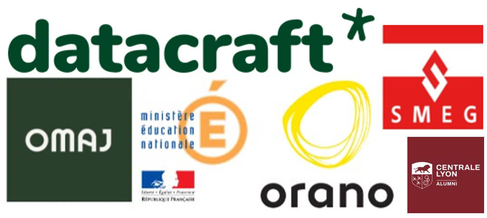

## Hi there, Welcome on my Github Page ! 

I'm passionate about coding and committed to turning my GitHub into a structured and valuable documentation hub. I focus on creating clear, reusable, and insightful resources to help others learn and build effectively.
___

### About Me 🚀
👨‍💻 Passionate about Data Science & AI  
🧑‍🎓 Lifelong learner, always curious  
✍️ Obsessed with clean, well-structured documentation  

___

### My Experiences 🙌
- [Data Scientist for smeg.mc (Internship)](https://www.smeg.mc/) 
- [Data Scientist for Education Nationale (Freelance)](https://www.education.gouv.fr/)
- [Data Scientist for Orano (Freelance)](https://www.orano.group/fr) 
- [Data Scientist for datacraft (Internship and freelance)](https://datacraft.paris/) 
- [Data Analyst for OMAJ (Internship)](https://omaj.fr/)

___

### 📌 Featured Projects

- 🔍 [**SQL Fast Learner**](https://github.com/Mastocodeur/sql-fast-learner)  
  A complete SQL learning course with theory and hands-on practice notebooks using **Jupyter Book**.  
  Topics include SELECT, JOIN, GROUP BY, subqueries, window functions, and more. Ideal for beginners and refreshing skills.
___

### ⚙️ Languages & Tech Stack

___

### 🌍 Connect with me

