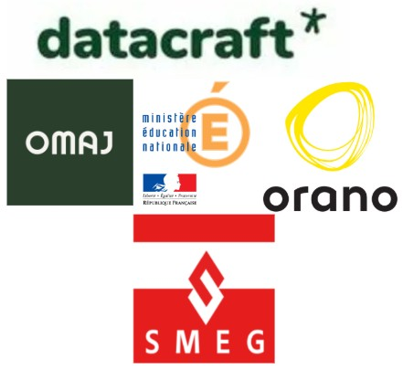

## Hi there 👋

I'm passionate about coding and want to transform my GitHub into a comprehensive documentation hub. I strive to create thorough, clear, and reusable files so that anyone can understand and make use of them.
___

### About Me 🚀
👨‍💻 I am passionate about Data Science & AI  
🧑‍🎓 I enjoy learning new things  
✍️ I love creating meticulously clean and well-structured documentation !

### My Experiences 🙌
- [Data Scientist for smeg.mc (Internship)](https://www.smeg.mc/) 
- [Data Scientist for Education Nationale (Freelance)](https://www.education.gouv.fr/)
- [Data Scientist for Orano (Freelance)](https://www.orano.group/fr) 
- [Data Scientist for datacraft (Internship and freelance)](https://datacraft.paris/) 
- [Data Analyst for OMAJ (Internship)](https://omaj.fr/)

<!--&nbsp;&nbsp;-->

 

## Welcome visitors ! 

<!--
**Mastocodeur/Mastocodeur** is a ✨ _special_ ✨ repository because its `README.md` (this file) appears on your GitHub profile.

Here are some ideas to get you started:

- 🔭 I’m currently working on ...
- 🌱 I’m currently learning ...
- 👯 I’m looking to collaborate on ...
- 🤔 I’m looking for help with ...
- 💬 Ask me about ...
- 📫 How to reach me: ...
- 😄 Pronouns: ...
- ⚡ Fun fact: ...
-->

