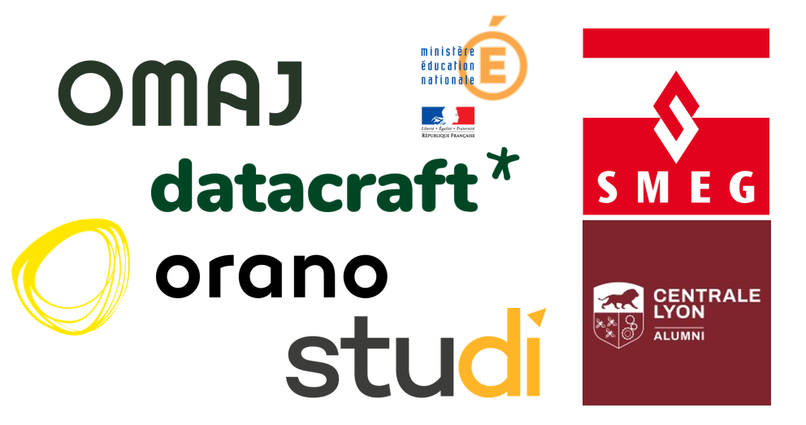

## Hi there, Welcome on my Github Page ! 

I'm passionate about coding and committed to turning my GitHub into a well-structured, valuable documentation hub.  
I focus on creating clear, reusable, and insightful resources to help others learn and build effectively.

___

### About Me 🚀
👨‍💻 Passionate about Data Science & AI  
🧑‍🎓 Lifelong learner, always curious  
✍️ Obsessed with clean, well-structured documentation  

___

### My Experiences 🙌
- [Data Scientist for smeg.mc (Internship)](https://www.smeg.mc/) 
- [Data Scientist for Education Nationale (Freelance)](https://www.education.gouv.fr/)
- [Data Scientist for Orano (Freelance)](https://www.orano.group/fr) 
- [Data Scientist for datacraft (Internship and freelance)](https://datacraft.paris/) 
- [Data Analyst for OMAJ (Internship)](https://omaj.fr/)

  

___

### Featured Projects 📌

- 🔍 [**SQL Fast Learner**](https://github.com/Mastocodeur/sql-fast-learner)  
  A complete SQL learning course with theory and hands-on practice notebooks using **Jupyter Book**.  
  Topics include SELECT, JOIN, GROUP BY, subqueries, window functions and more. Ideal for beginners, refresher courses or further training.
___

### Current projects 🚧

🤖 NeaflFun Password
An intelligent automation project in which an LLM is connected via Selenium to a dynamic password creation site. The aim: to generate a password that adapts in real time to the security rules that gradually appear on the screen.

🧠 Analysis X: Trump and Squeezie on Twitter
A project to analyse feelings and compare speeches based on scraping tweets. In it I explore the contrasts between political (Donald Trump) and entertainment (Squeezie) communication, applying NLP, text cleaning and visualisation techniques.

🎓 Preparing for Scikit-learn advanced certification
Exploration and advanced learning of the Scikit-learn library. This project involves an in-depth review of advanced concepts (model selection, pipelines, tuning, etc.) to aim for sklearn's most demanding supervised machine learning certification.

___

### Languages & Tech Stack ⚙️ 

  

___

### Connect with me 🌍 

